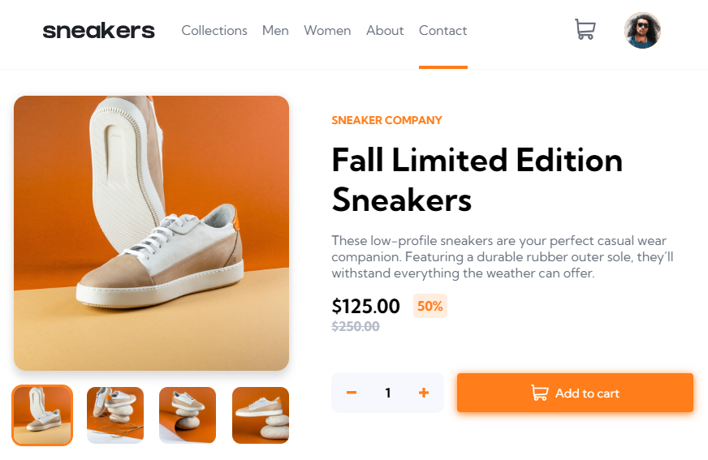
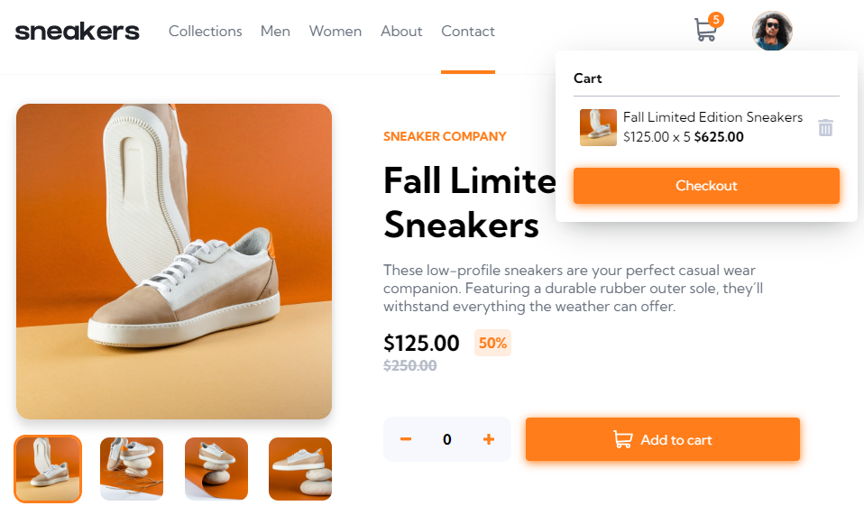
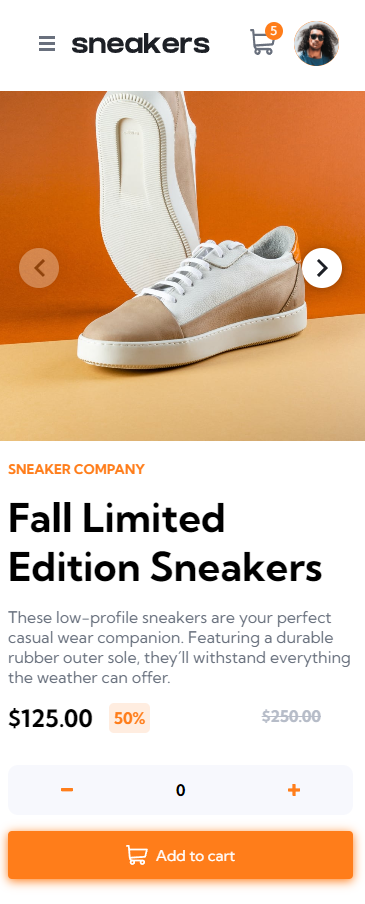
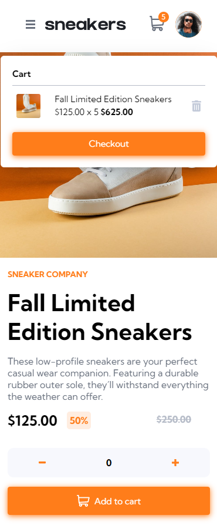

# Frontend Mentor - E-commerce product page solution

This is a solution to the [E-commerce product page challenge on Frontend Mentor](https://www.frontendmentor.io/challenges/ecommerce-product-page-UPsZ9MJp6). Frontend Mentor challenges help you improve your coding skills by building realistic projects.

## Table of contents

- [Overview](#overview)
  - [The challenge](#the-challenge)
  - [Screenshot](#screenshot)
  - [Links](#links)
- [My process](#my-process)
  - [Built with](#built-with)
  - [What I learned](#what-i-learned)

## Overview

### The challenge

Users should be able to:

- View the optimal layout for the site depending on their device's screen size
- See hover states for all interactive elements on the page
- Open a lightbox gallery by clicking on the large product image
- Switch the large product image by clicking on the small thumbnail images
- Add items to the cart
- View the cart and remove items from it

### Screenshot

### Links

- Solution URL: 

## My process

### Built with

- [React](https://reactjs.org/) - JS library
- [Radix](https://www.radix-ui.com/) - Primitive Components
- [Stitches](https://stitches.dev/) - CSS-in-JS 
- [Redux](https://redux-toolkit.js.org/) - it was not necessary, just for practice
- [Embla-Carousel](https://www.embla-carousel.com/) - for mobile screen gallery
- [Router-v6](https://reactrouter.com/en/main) . it was not necessary, just for practice
- [Eslint](https://eslint.org/) 

### What I learned

- Learned to use Radix primitive components. (Avatar, Popover, Dialog, Toast, Separator)
- Learned to implement Stitches CSS-in-js. (Styled and CSS properties, Variants, Config file, Media Queries)

